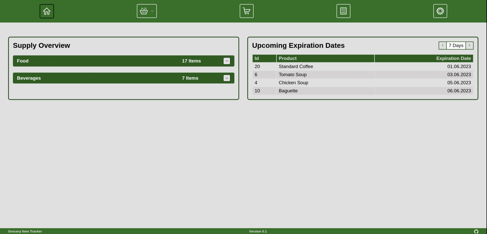
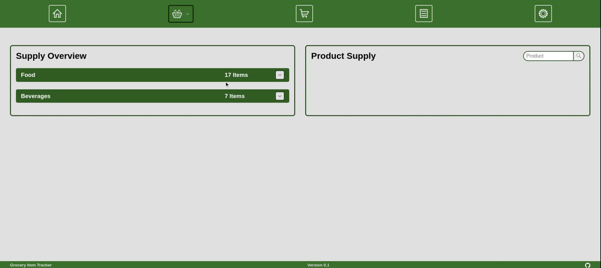
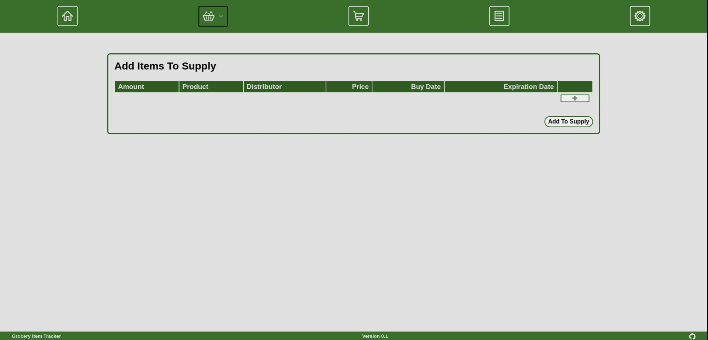
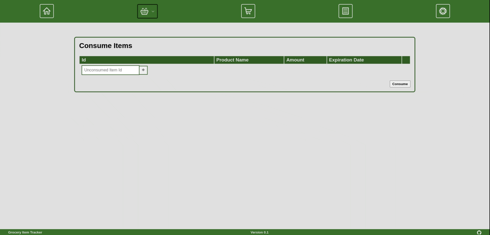

# **Grocery Item Tracker**
 
 

## **Table Of Contents**
 

- [**Grocery Item Tracker**](#grocery-item-tracker)
  - [**Table Of Contents**](#table-of-contents)
  - [**About This Project**](#about-this-project)
  - [**Techstack**](#techstack)
  - [**Installation**](#installation)
  - [**Features To Add**](#features-to-add)
  - [**Version History**](#version-history)
    - [**Version 0.1**](#version-01)
  - [**Screen Captures**](#screen-captures)

 
 

## **About This Project**
 

A web application for keeping track of grocery items. The basic idea is to register the items after purchase within the application and physically tag them with their assigned id. This later allows the user to mark individual grocery items as consumed.

 

The application should provide the user with the following core features:

- [x] overview of current supply
- [x] add items to supply
- [x] consume items from supply
- [ ] generate a shopping list
- [ ] generate reports about grocery purchases and consumption

 
 

    

<b>Dashboard</b>

 
 

## **Techstack**

|Languages |Frontend |Backend |Databases |Testing |Bundler |
|:--------:|:-------:|:------:|:--------:|:------:|:------:|
| | | | | | |
| | | | | | |
| | | | | | |

## **Installation**
 

## **Features To Add**
 

## **Version History**
 

### **Version 0.1**
 

## **Screen Captures**

 
 

    

<b>Dashboard</b>

 
 
 
 

    

<b>Supply Overview</b>

 
 
 
 

    

<b>Add Items To Supply</b>

 
 
 
 

    

<b>Add New Product</b>

 
 
 
 

    

<b>Consume Items</b>
