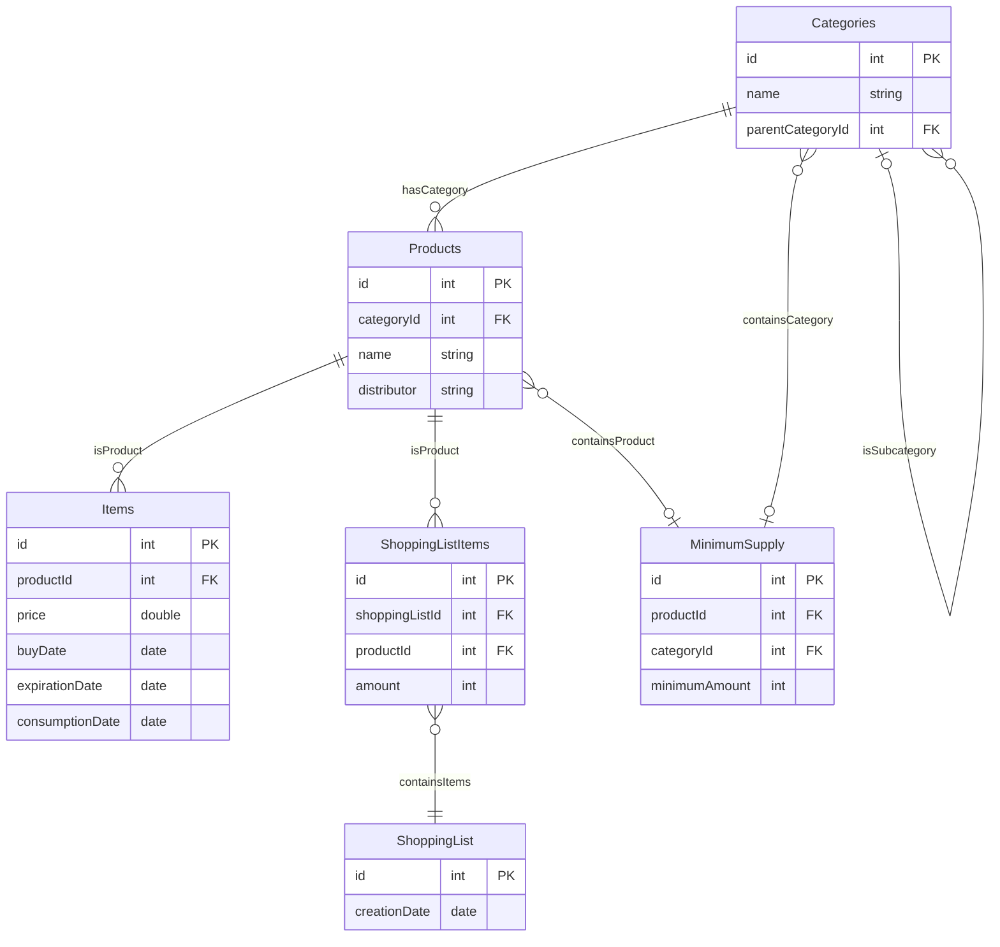

# **Implementation Grocery Item Tracker**
 

## **Table Of Contents**
 

- [**Implementation Grocery Item Tracker**](#implementation-grocery-item-tracker)
  - [**Table Of Contents**](#table-of-contents)
  - [**Database**](#database)

 
 
 

## **Database**
 
 

