# **Implementation Grocery Item Tracker**
<br>

## **Table Of Contents**
<br>

- [**Implementation Grocery Item Tracker**](#implementation-grocery-item-tracker)
  - [**Table Of Contents**](#table-of-contents)
  - [**Client-Server-Architecture**](#client-server-architecture)
    - [**API**](#api)
      - [**API Overview**](#api-overview)
      - [**API Routes**](#api-routes)
        - [**/api/supplyOverview**](#apisupplyoverview)
        - [**/api/supplyOverview/get/productList**](#apisupplyoverviewgetproductlist)
        - [**/api/supplyOverview/get/productData/:productId**](#apisupplyoverviewgetproductdataproductid)
        - [**/api/addSupplyItems/get/categoryData**](#apiaddsupplyitemsgetcategorydata)
        - [**/api/addSupplyItems/post/addTopCategoryData**](#apiaddsupplyitemspostaddtopcategorydata)
        - [**/api/addSupplyItems/post/addSubCategoryData**](#apiaddsupplyitemspostaddsubcategorydata)
        - [**/api/consumeSupplyItems/get/itemInformationForId:id**](#apiconsumesupplyitemsgetiteminformationforidid)
        - [**/api/consumeSupplyItems/post/consumeItems**](#apiconsumesupplyitemspostconsumeitems)
        - [**/api/addSupplyItems/get/measurementUnitData**](#apiaddsupplyitemsgetmeasurementunitdata)
        - [**/api/addSupplyItems/post/addNewProduct**](#apiaddsupplyitemspostaddnewproduct)
        - [**/api/addSupplyItems/get/distributorNameList**](#apiaddsupplyitemsgetdistributornamelist)
        - [**/api/addSupplyItems/post/addNewDistributor**](#apiaddsupplyitemspostaddnewdistributor)
        - [**/api/home/expirationDateOverview/get/:dayLimit**](#apihomeexpirationdateoverviewgetdaylimit)
        - [**/api/addSupplyItems/get/productNameList**](#apiaddsupplyitemsgetproductnamelist)
        - [**/api/addSupplyItems/post/addItemsToSupply**](#apiaddsupplyitemspostadditemstosupply)
        - [**/api/consumeSupplyItems/get/unconsumedItemIdList**](#apiconsumesupplyitemsgetunconsumeditemidlist)
    - [**Database**](#database)

<br>
<br>
<br>

## **Client-Server-Architecture**
<br>


<br>
<br>
<br>
<br>

### **API**
<br>
<br>
<br>

#### **API Overview**
<br>

|Type |Route                                            |Parameter |Used By Frontend Component |
|:---:|:------------------------------------------------|:--------:|---------------------------|
|GET  |[/api/supplyOverview](#apisupplyoverview)        |-         |SupplyOverview.tsx         |
|GET  |[/api/supplyOverview/get/productList](#apisupplyoverviewgetproductlist)              |-         |SupplyOverview.tsx         |
|GET  |[/api/supplyOverview/get/productData/](#apisupplyoverviewgetproductdataproductid)             |productId |SupplyOverview.tsx         |
|GET  |[/api/addSupplyItems/get/categoryData](#apiaddsupplyitemsgetcategorydata)             |-         |AddNewCategories.tsx       |
|POST |[/api/addSupplyItems/post/addTopCategoryData](#apiaddsupplyitemspostaddtopcategorydata)      |-         |AddNewCategories.tsx       |
|POST |[/api/addSupplyItems/post/addSubCategoryData](#apiaddsupplyitemspostaddsubcategorydata)      |-         |AddNewCategories.tsx       |
|GET  |[/api/consumeSupplyItems/get/itemInformationForId](#apiconsumesupplyitemsgetiteminformationforidid) |id        |ConsumeSupplyItems.tsx     |
|POST |[/api/consumeSupplyItems/post/consumeItems](#apiconsumesupplyitemspostconsumeitems)        |-         |ConsumeSupplyItems.tsx     |
|GET  |[/api/addSupplyItems/get/measurementUnitData](#apiaddsupplyitemsgetmeasurementunitdata)      |-         |AddNewProductForm.tsx      |
|POST |[/api/addSupplyItems/post/addNewProduct](#apiaddsupplyitemspostaddnewproduct)           |-         |AddNewProductForm.tsx      |
|GET  |[/api/addSupplyItems/get/distributorNameList](#apiaddsupplyitemsgetdistributornamelist)      |-         |DistributorInput.tsx       |
|POST |[/api/addSupplyItems/post/addNewDistributor](#apiaddsupplyitemspostaddnewdistributor)       |-         |DistributorInput.tsx       |
|GET  |[/api/home/expirationDateOverview/get/](#apihomeexpirationdateoverviewgetdaylimit)            |dayLimit  |ExpirationDateOverview.tsx |
|GET  |[/api/addSupplyItems/get/productNameList](#apiaddsupplyitemsgetproductnamelist)          |-         |ProductInput.tsx           |
|POST |[/api/addSupplyItems/post/addItemsToSupply](#apiaddsupplyitemspostadditemstosupply)        |-         |AddedItemsPreview.tsx      |
|GET  |[/api/consumeSupplyItems/get/unconsumedItemIdList](#apiconsumesupplyitemsgetunconsumeditemidlist) |-         |ItemIdDropdown.tsx         |

<br>
<br>
<br>

#### **API Routes**
<br>
<br>
<br>

##### **/api/supplyOverview**
<br>

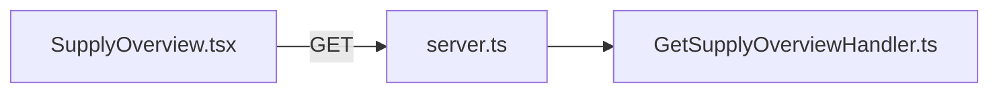

<br>

**SQL Statement**

```sql
select *
from GrocerySupplyOverview;
```

<br>

**Parsing**
- split database result by
  - TopCategory
  - SubCategory
  - Product

<br>

**Response Data**

```typescript
type SupplyOverviewFrontendData = {
   data: TopCategory[]
};


type TopCategory = {
   name: string,
   total: number,
   minimum?: number,
   subCategoryList?: SubCategory[]
};


type SubCategory = {
   name: string,
   total: number,
   minimum?: number,
   productList?: ProductSupplyOverview[]
};


type ProductSupplyOverview = {
   name: string,
   total: number,
   minimum?: number
};
```

<br>

**Response example**

```json
{
    "data": [
        { 
            "name": "Food",
            "total": 34,
            "minimum": 23,
            "subCategoryList": [
                {
                    "name": "Bread",
                    "total": 5,
                    "minimum": 4,
                    "productList": [
                        {
                            "name": "Toast",
                            "total": 2,
                            "minimum": 3
                        },
                        {
                            "name": "Baguette",
                            "total": 3,
                            "minimum": 4
                        },
                    ]
                },
                ...
            ]
        },
        ...
    ]
}
```

<br>
<br>
<br>

##### **/api/supplyOverview/get/productList**
<br>

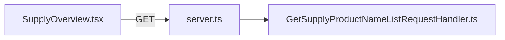

<br>

**SQL Statement**

```sql
select *
from ProductsInSupply
order by name asc;
```

<br>

**Response Data**

```typescript
ProductListDatabaseRecord[]

type ProductListDatabaseRecord = {
   id: number,
   name: string
};
```

<br>
<br>
<br>

##### **/api/supplyOverview/get/productData/:productId**
<br>

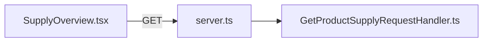

<br>

**SQL Statement**

```sql
select * 
from GrocerySupplyList 
where product = (select name from Products where id = ?)
order by expirationDate asc;
```
* ? = parameter productId

<br>

**Response Data**

```typescript
SupplyListDatabaseRecord[]

type SupplyListDatabaseRecord = {
   topcategory: string,
   subcategory: string,
   product: string,
   id: number,
   distributor: string,
   buyDate: string,
   expirationDate: string
};
```

<br>
<br>
<br>

##### **/api/addSupplyItems/get/categoryData**
<br>

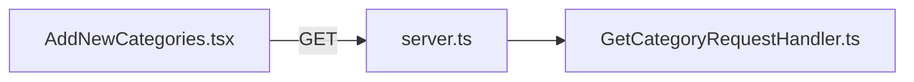

<br>

**SQL Statement**

```sql
select *
from Categories;
```

<br>

**Response Data**

```typescript
CategoryData[]

type CategoryData = {
   id: number,
   name: string,
   parentCategoryId: number
};
```

<br>
<br>
<br>

##### **/api/addSupplyItems/post/addTopCategoryData**
<br>

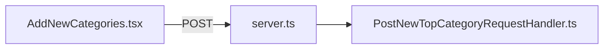

<br>

**Request Data**

```typescript
{ category: string }
```

<br>

**SQL Statement**

```sql
Insert into Categories (name)
values (?)
```

<br>

**Response Data**

```typescript
{ ok: number }
```

<br>
<br>
<br>

##### **/api/addSupplyItems/post/addSubCategoryData**
<br>

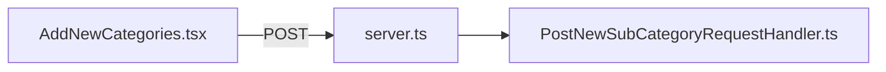

<br>

**Request Data**

```typescript
{ topCategory: string, subCategory: string }
```

<br>

**SQL Statements**

```sql
select id
from Categories
where name = ?;

Insert into Categories (name, parentCategoryId)
values (?, ?);
```

<br>

**Response Data**

```typescript
{ ok: number }
```

<br>
<br>
<br>

##### **/api/consumeSupplyItems/get/itemInformationForId:id**
<br>

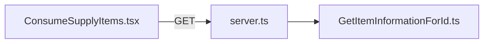

<br>

**SQL Statement**

```sql
select s.id , p.name as productName, concat(p.weight, m.unitSymbol) as amount, s.expirationDate
from 
    (select * from Supply where consumptionDate is null and id = ?) as s
    inner join Products as p on s.productId = p.id
    inner join MeasurementUnits as m on p.measurementUnitId = m.id;
```

<br>

**Response Data**

```typescript
type ResponseType = {
   data: PreviewConsumedItem
};

type PreviewConsumedItem = {
   id: number,
   productName: string,
   amount: string,
   expirationDate: string
};
```

<br>
<br>
<br>

##### **/api/consumeSupplyItems/post/consumeItems**
<br>

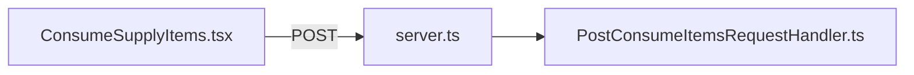

<br>

**Request Data**

```typescript
{ idList: number[] }
```

<br>

**SQL Statements**

```sql
update Supply
set consumptionDate = curDate()
where id in (?)
```

<br>

**Response Data**

```typescript
type ConsumeItemsFromSupplyResponse = {
   ok: number
};
```

<br>
<br>
<br>

##### **/api/addSupplyItems/get/measurementUnitData**
<br>

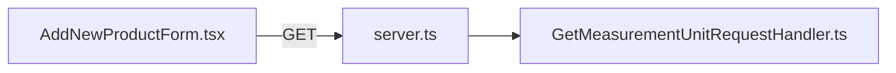

<br>

**SQL Statement**

```sql
select unitSymbol
from MeasurementUnits
order by unitSymbol asc;
```

<br>

**Response Data**

```typescript
MeasurementUnitData[]

type MeasurementUnitData = {
   unitSymbol: string
};
```

<br>
<br>
<br>

##### **/api/addSupplyItems/post/addNewProduct**
<br>

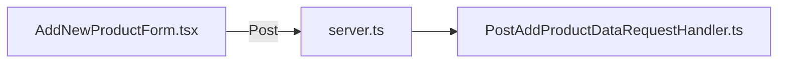

<br>

**Request Data**

```typescript
type payload = {
    productName: string,
    categoryName: string,
    subcategoryName: string,
    weight: number,
    unit: string
};
```

<br>

**SQL Statements**

```sql
select id
from Categories
where name = ?;

select id
from MeasurementUnits
where unitSymbol = ?;

Insert into Products (categoryId, measurementUnitId, weight, name)
values (?, ?, ?, ?);
```

<br>

**Response Data**

```typescript
{ payload: resultSet }
```

<br>
<br>
<br>

##### **/api/addSupplyItems/get/distributorNameList**
<br>

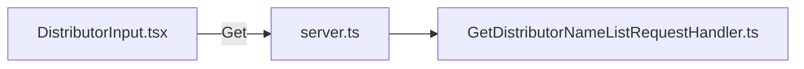

<br>

**SQL Statement**

```sql
select name
from Distributor
order by name asc;
```

<br>

**Response Data**

```typescript
DistributorNameList[]

type DistributorNameList = {
   name: string
};
```

<br>
<br>
<br>

##### **/api/addSupplyItems/post/addNewDistributor**
<br>

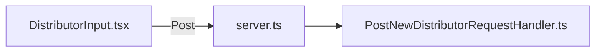

<br>

**Request Data**

```typescript
const payload = { distributor: string };
```

<br>

**SQL Statement**

```sql
select id
from Distributor
where name = ?;

insert into Distributor (name)
values (?)
```

<br>

**Response Data**

```typescript
{ ok: number }
```

<br>
<br>
<br>

##### **/api/home/expirationDateOverview/get/:dayLimit**
<br>

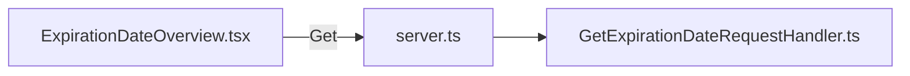

<br>

**SQL Statement**

```sql
select * 
from UpcomingExpirationDates
where datediff(expirationDate, now()) <= ?;
```

<br>

**Response Date**

```typescript
type ExpirationDateFrontendData = {
   data: ExpirationDateDatabaseRecord[];
};

type ExpirationDateDatabaseRecord = {
   id: number,
   product: string,
   expirationDate: string
};
```

<br>
<br>
<br>

##### **/api/addSupplyItems/get/productNameList**
<br>

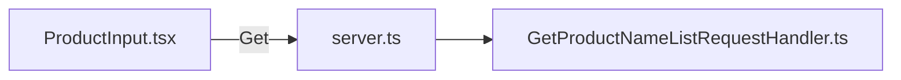

<br>

**SQL Statement**

```sql
select name
from Products
order by name asc;
```

<br>

**Response Data**

```typescript
ProductNameListData[]

type ProductNameListData = {
   name: string
};
```

<br>
<br>
<br>

##### **/api/addSupplyItems/post/addItemsToSupply**
<br>

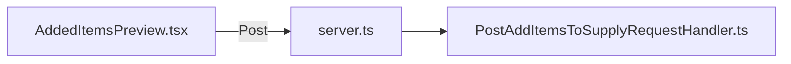

<br>

**Request Data**

```typescript
{ data: GroceryItemData[] }


type GroceryItemData = {
   id: number,
   productName: string,
   distributor: string,
   amount: number,
   pricePerUnit: number,
   buyDate: string,
   expirationDate: string
};
```

<br>

**SQL Statements**

```sql
select id
from Products
where name = ?;

select id
from Distributor
where name = ?;

insert into Supply (productId, distributorId, price, buyDate, expirationDate)
value (?, ?, ?, ?, ?);
```

<br>

**Response Data**

```typescript
type AddItemToSupplyResponse = {
   ok: number,
   data?: AddedItemReceiptData[]
};

type AddedItemReceiptData = {
   id: string,
   productName: string,
   distributor: string,
   buyDate: string,
   expirationDate: string
};
```

<br>
<br>
<br>

##### **/api/consumeSupplyItems/get/unconsumedItemIdList**
<br>

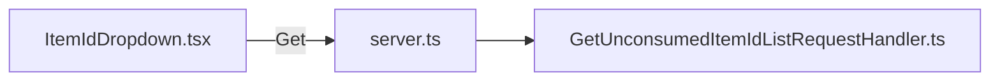

<br>

**SQL Statement**

```sql
select id
from Supply
where consumptionDate is null
order by id asc;
```

<br>

**Response Data**

```typescript
number[]
```

<br>
<br>
<br>
<br>

### **Database**
<br>

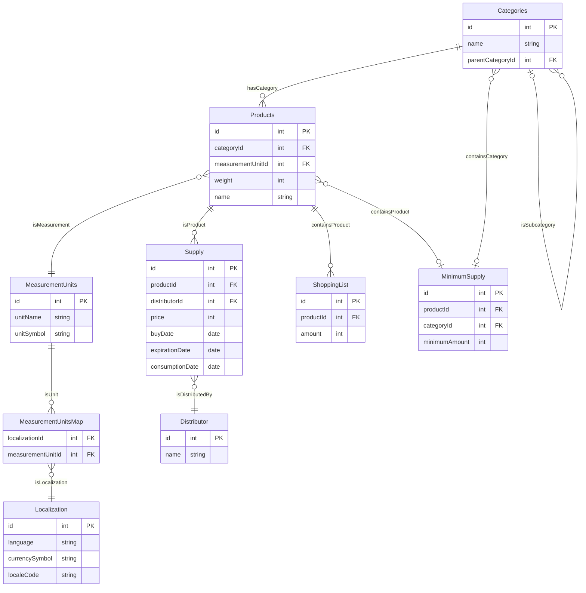