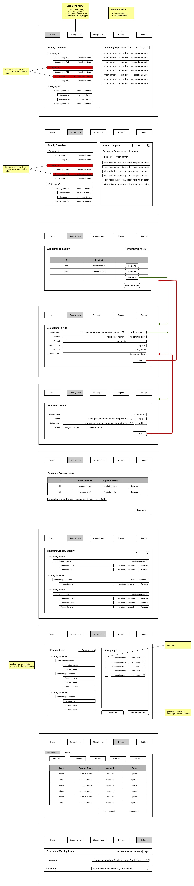

# **Requirements Grocery Item Tracker**
 

## **Table Of Contents**
 

- [**Requirements Grocery Item Tracker**](#requirements-grocery-item-tracker)
  - [**Table Of Contents**](#table-of-contents)
  - [**Required Features**](#required-features)
    - [**Add Grocery Item To Supply**](#add-grocery-item-to-supply)
    - [**Add Product Information**](#add-product-information)
    - [**Add Product Category Information**](#add-product-category-information)
    - [**Add Product Subcategory Information**](#add-product-subcategory-information)
    - [**Add Distributor Information**](#add-distributor-information)
    - [**List Current Grocery Item Supply**](#list-current-grocery-item-supply)
    - [**Mark Grocery Items As Consumed**](#mark-grocery-items-as-consumed)
    - [**Define Minimum Grocery Item Supply**](#define-minimum-grocery-item-supply)
    - [**List Expiration Dates**](#list-expiration-dates)
    - [**Generate Shopping List**](#generate-shopping-list)
    - [**Generate Report About Consumption**](#generate-report-about-consumption)
    - [**Generate Report About Shopping History**](#generate-report-about-shopping-history)
    - [**Change Language**](#change-language)
    - [**Configure Database Connection**](#configure-database-connection)
      - [**MySQL Database**](#mysql-database)
      - [**indexedDB**](#indexeddb)
  - [**Use Case Diagram**](#use-case-diagram)
  - [**UI Mockup**](#ui-mockup)

 
 
 

## **Required Features**
 
 

### **Add Grocery Item To Supply**
 

* select product name
* select amount of added items
* select price of added items
* select expiration date of added items
* display added products before saving
* ability to delete added products before saving
* save added food items to database

 
 

### **Add Product Information**
 

* add product name
* select category
* select subcategory
* select distributor
* save product to database

 
 

### **Add Product Category Information**
 
 

### **Add Product Subcategory Information**
 
 

### **Add Distributor Information**
 
 

### **List Current Grocery Item Supply**
 

* list all grocery items ordered by category and subcategory
* display number of items per category and subcategory
* ability to collapse categories and subcategories
* filter list by
  * category name
  * subcategory name
  * product name
  * item id

 
 

### **Mark Grocery Items As Consumed**
 

* add consumed product by id
* list products marked as consumed
* ability to unmark products
* save consumed food items to database

 
 

### **Define Minimum Grocery Item Supply**
 

* add product to minimum supply
* select minimum product supply
* list mimimum product supply per category and subcategory
* remove product from minimum supply

 
 

### **List Expiration Dates**
 

 
 

### **Generate Shopping List**
 

* list products per category and subcategory
* filter available products by product name
* add products and amount to shopping list

 
 

### **Generate Report About Consumption**
 

* list consumed amount and cost of food items per
  * last week
  * last month
  * last year
  * user defined timeframe

 
 

### **Generate Report About Shopping History**
 

* list bought food items and cost per
  * last week
  * last month
  * last year
  * user defined time frame

 
 

### **Change Language**
 

* supported languages:
  * english
  * german

 
 

### **Configure Database Connection**
 
 

#### **MySQL Database**
 

* define hostname and port of database server
* setup database user for application
* setup database schema

 
 

#### **indexedDB**
 

* setup database schema

 
 
 

## **Use Case Diagram**
 
 

 
 
 

## **UI Mockup**
 
 

